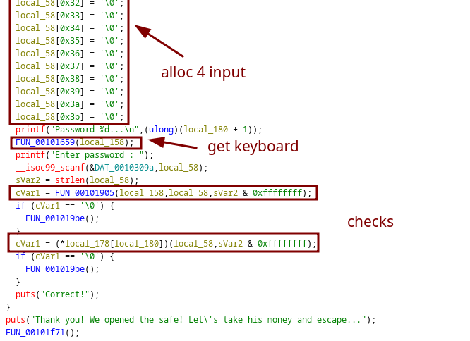
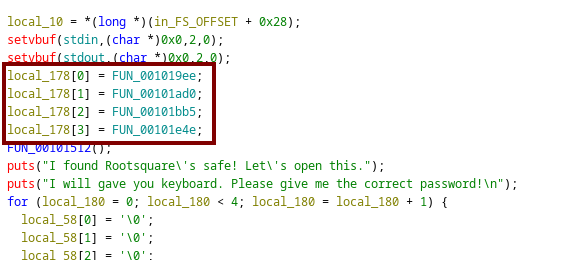
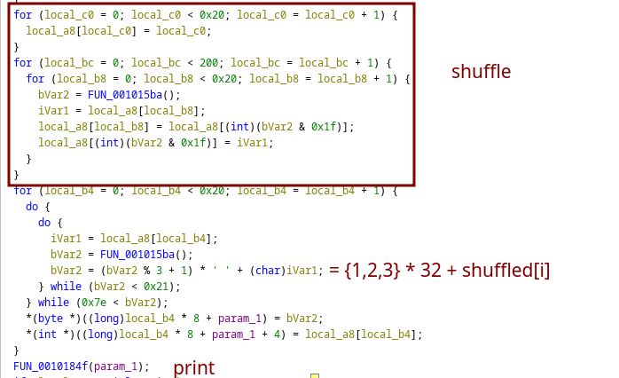
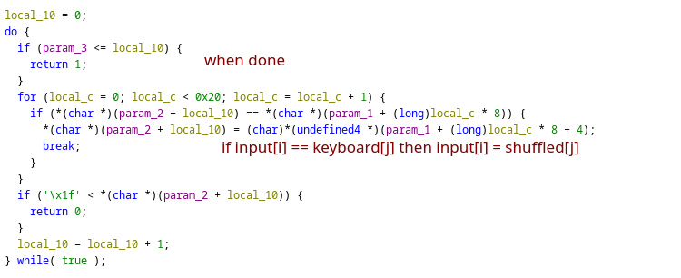
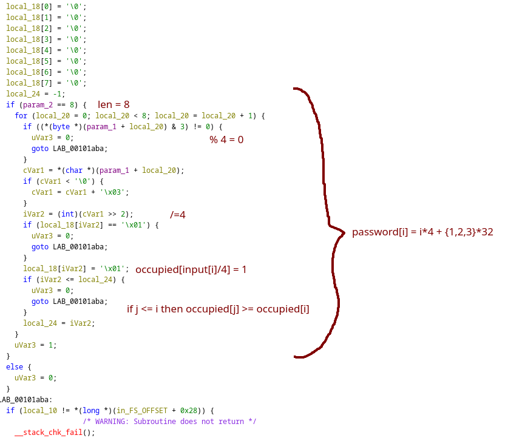
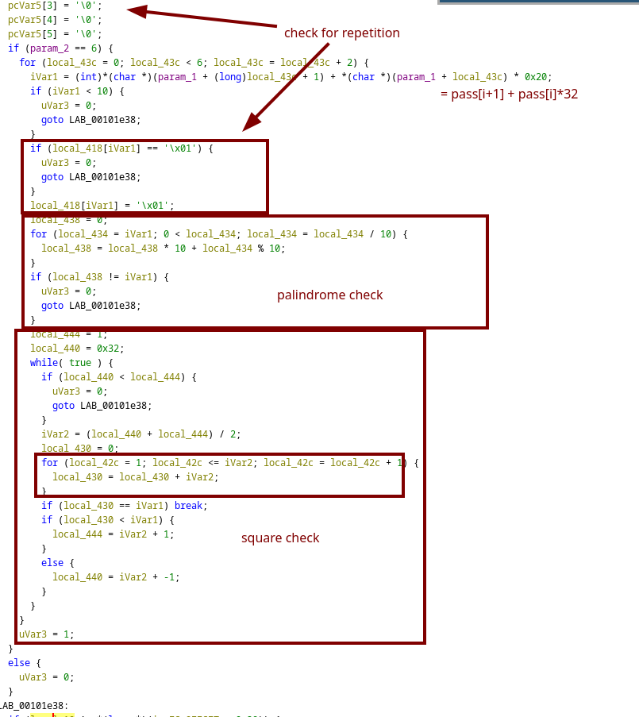
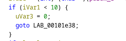
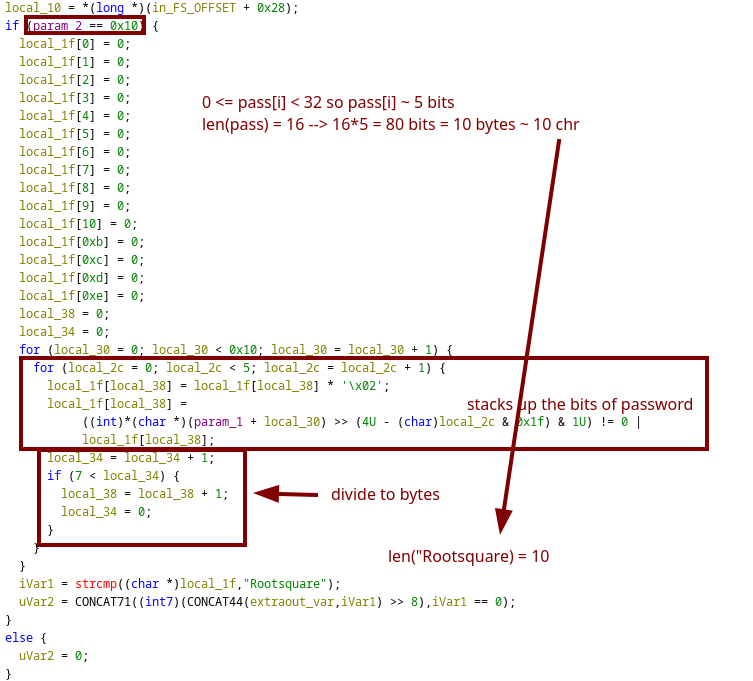
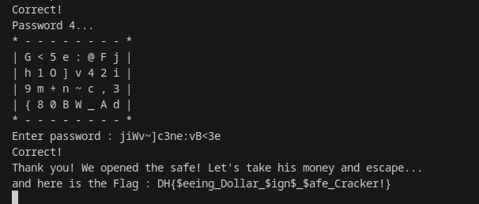

## [Rootsquare's safe](https://dreamhack.io/wargame/challenges/1988)

performs 2 checks



What is `(*local_178[local_180])(local_58,sVar2 & 0xffffffff)`?



`local_178` is the pointer to the *lock functions*, so this safe has 4 locks.

### The keyboard



```
lines = [re.findall(r'\| (.*) \|', input()) for i in range(4)]
keys = [key for l in lines for li in l for key in li.split()]
```

### The 1st lock


```
print("".join(c for i in range(8) for c in chrs if (ord(c) % 32) % 4 == 0 and (ord(c) % 32) // 4 == i))
```


### The 2nd lock


```
print("".join(c for i in [(year>>10) & 0x1f, (year>>5) & 0x1f, year & 0x1f, month, day] for c in chrs if ord(c) % 32 == i))
```

### The 3rd lock



oh i forgor this 



```
key = []
for j in range(1,33):
	s = j*j
	if str(s) == str(s)[::-1] and s >= 10: key.extend([(s//32) % 32, s % 32])
	if len(key) >= 6: break

print("".join(c for i in key for c in chrs if ord(c) % 32 == i))
```

### The last lock



pardon me 
```
print("".join(c for i in (lambda x: [int(x[i:i+5], 2) for i in range(0, len(x), 5)])("".join(f"{ord(c):08b}" for c in "Rootsquare")) for c in chrs if ord(c) % 32 == i))
```

### Flag

[full script](https://github.com/leovanbon/mypyparsescripts/blob/main/savesafesafe.py)

poc:



`DH{$eeing_Dollar_$ign$_$afe_Cracker!}`

