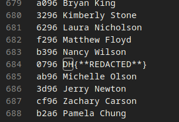
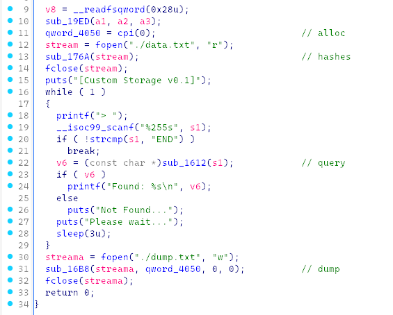

the given program reads from `data.txt` (not provided) and writes to `dump.txt` (provided)

the `dump.txt` consists of names, each one has a 16-bit tag



our ~~flag~~ lies there as well



the tags in `dump.txt` are hashes of the tags in `data.txt`
i have rewritten the hash algo:
```
def sub_1349(a1):
	return (0x5678 * ((0x4680 * a1) | (((0x1234 * a1) & 0xffff) >> 11))) & 0xffff
	
def h4sh(tag):
	b = 0xcafe
	for i in range(len(tag) // 2):
		c = tag[2*i] + 256 * tag[2*i + 1]
		tmp = sub_1349(c)
		b = (5 * (((tmp ^ b) << 7) | (((b ^ tmp) >> 9) & 0xffff)) + 0xdead) & 0xffff
	if len(tag) & 1:
		v8 = tag[-1]
	else:
		v8 = 0
	tmp = sub_1349(v8)
	v = (0xdead * ((((b ^ len(tag) ^ tmp) & 0xffff) >> 8) ^ b ^ len(tag) ^ tmp)) & 0xffff
	res = ((((0xdead * ((v >> 5) ^ v)) & 0xffff) >> 8) ^ (0xdead * ((v >> 5) ^ v))) & 0xffff
	# print(f"{res:04x}")
	return f"{res:04x}".encode()
```

after confirming with pwndbg, i brute force:

```
xeh = "0123456789ABCDEF"
pay = []
target = b'0796'
for a1 in range(16):
	if target == h4sh(xeh[a1].encode()): pay.append(xeh[a1].encode())
	for a2 in range(16):
	m2 = xeh[a1] + xeh[a2]
		if target == h4sh(m2.encode()): pay.append(m2.encode())
		for a3 in range(16):
			m3 = m2 + xeh[a3]
			if target == h4sh(m3.encode()): pay.append(m3.encode())
				for a4 in range(16):
					m4 = m3 + xeh[a4]
					if target == h4sh(m4.encode()): pay.append(m4.encode())
#print(pay)
```

and then

```
from pwn import *
p = remote("host_.dreamhack.games", ____)
for pa in pay:
	p.recvuntil(b'> ')
	p.sendline(pa)
	response = p.recvline()
	if b"DH{" in response:
		print(f"{response.decode().strip()}")
		break
```

done:

`Found: DH{H4SHC0LL1S10N_0N_TH3_D4T4_S7RUCTUR3}`