# nucleus [rev]

the challenge provided a binary `nucleus21.exe`. I tried running it and it creates a new file `nucleus22.exe` after getting an input, noted that the new file is larger

## First impression

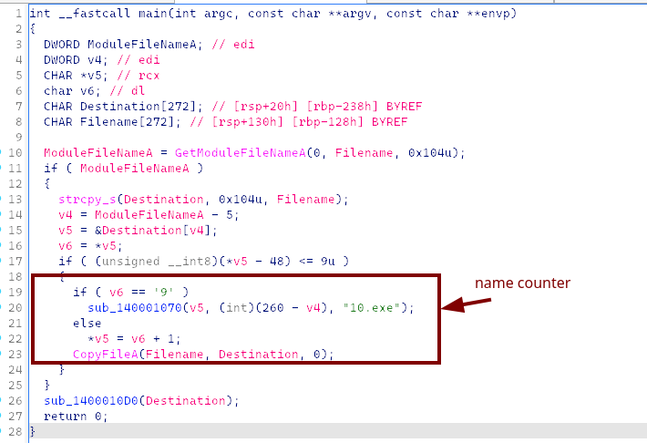

first, it makes a copy of itself (with different index)
and then the `sub_1400010D0` modifies that new copy

## Inside 

note that v7 holds a copy of the file

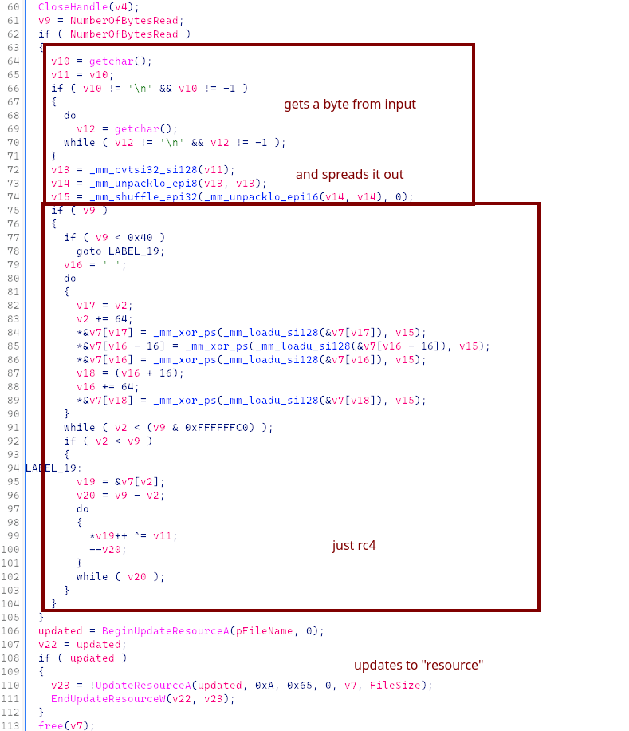

Матрёша, eh?
1. Address the "resource", how do we extract it?
2. How should we recover the bytes?


## Solution

1. By looking up, I found that the resource section is `.rsrc`, claude get me an extract script
2. It xored the entire binary file, which means the magic bytes also get xored

```
import pefile
from pwn import xor

flag = ""

for i in range(20, -1, -1):
	pe = pefile.PE(f"nucleus{i+1}.exe")
	for res_type in pe.DIRECTORY_ENTRY_RESOURCE.entries:
		if res_type.id == pefile.RESOURCE_TYPE['RT_RCDATA']:
			for res_id in res_type.directory.entries:
				if res_id.id == 101:
					for res_lang in res_id.directory.entries:
						data_rva = res_lang.data.struct.OffsetToData
						size = res_lang.data.struct.Size
						payload = pe.get_data(data_rva, size)
						key = payload[0] ^ ord('M')
						flag += chr(key)
						open(f"nucleus{i}.exe", "wb").write(xor(payload,key))

print(flag[::-1])
```

## Flag

`gigem{RCD4Ta_i5_N3aT}`

# challenge7 [rev]

The challenge provides a binary file `challenge7` that validate an input
A quick scan and i caught these:

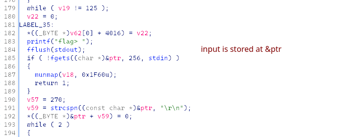

And then the input stay untouched, get passed to a JIT function compiled with some VM like code

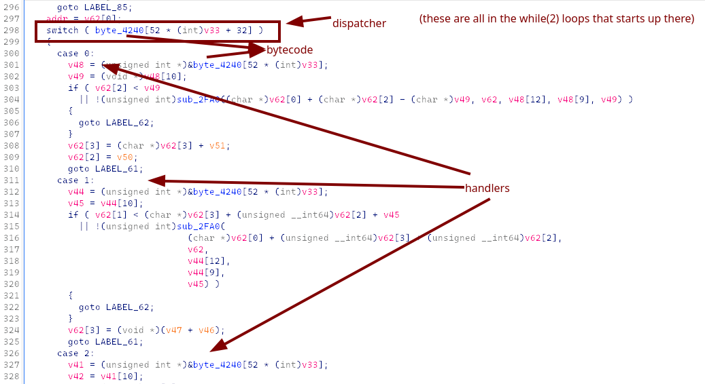

scrolling down

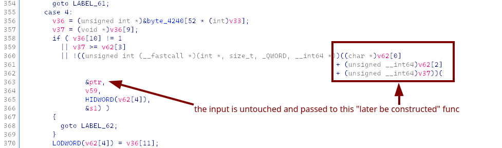

I think we should set a breakpoint there and dump out the validating function(s), eh?
Let's check for anti-debugging measures, there should be some stepping in our way

## The hunt

### outside the loop

I first found this

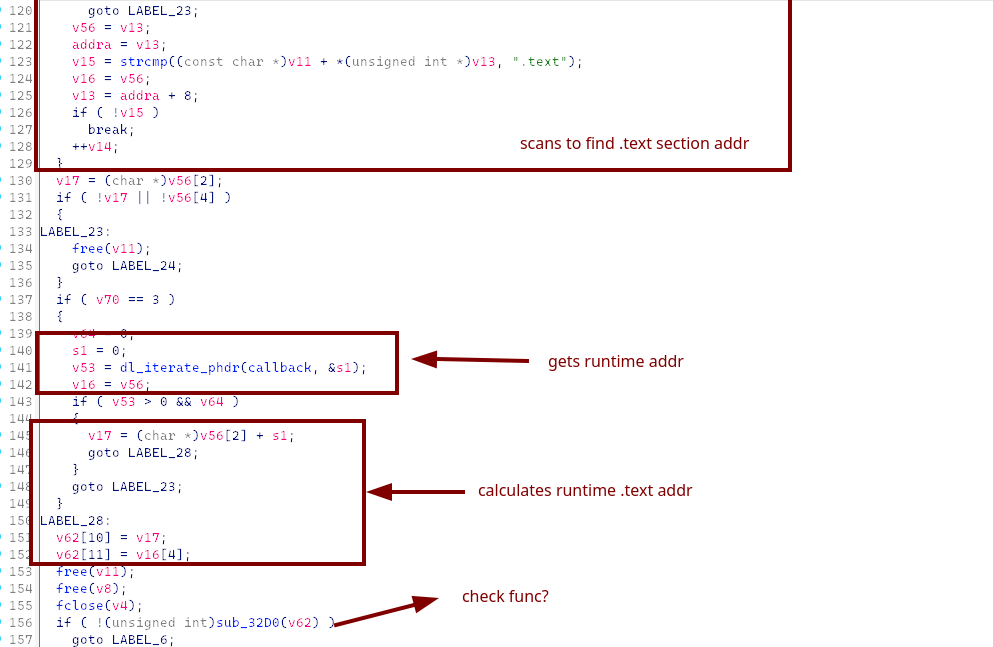

The `sub_32D0` appears at the start of the loop aswell, let's see what's inside

### `sub_32D0`

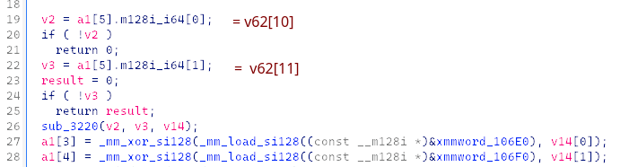

While inspecting the `xmmword_106E0`, i found something fammiliar

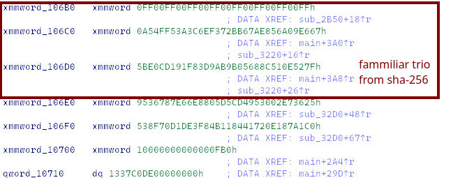

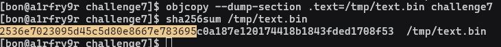

it matches the `xmmword_106E0`, concluded that `sub_3220` is sha-256, from then derived that `sub_2B60`, `sub_3010` are also process of sha-256 (ima rename them for later analysis)

if the hash pass then `a1[3] = a1[4] = 0`

The rest of this check function is just debugger check (`iPrecarT :d`) and hook check (`LD_PRELOAD`): it corrputs `a1[3]` and `a1[4]` if there is anything suspicious

We can conclude that `sub_32D0` sets `v62[6] = ... = v62[9] = 0` (if things run normally)

With that finding, **i just need to set an eye for anything that touches `v62[6:10]`**, also `v62[10:12]` because they hold information of the runtime `.text`

### inside the loop

found just this one

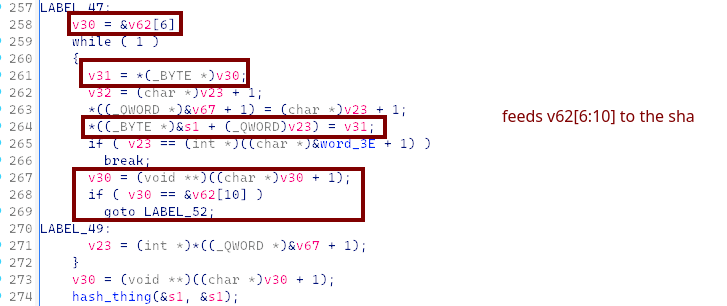

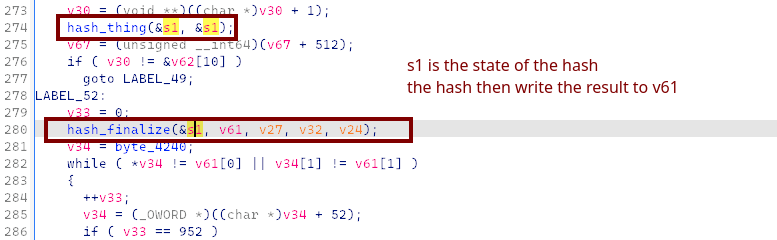

The other parts are just VM things, it feeds the VM state into that hashes too
I guess we don't need to touch them (read all that shi feel dizzy as hell nah)

## Patching

I get that we just need to patch the `sub_3220` for it to not screw up our `v62`

hmmmmmmm.....

"Hey claude, nop-nuke this shit for me (remember to return 1)."

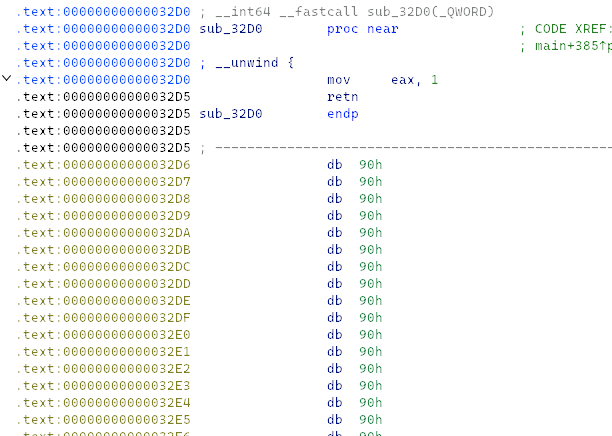

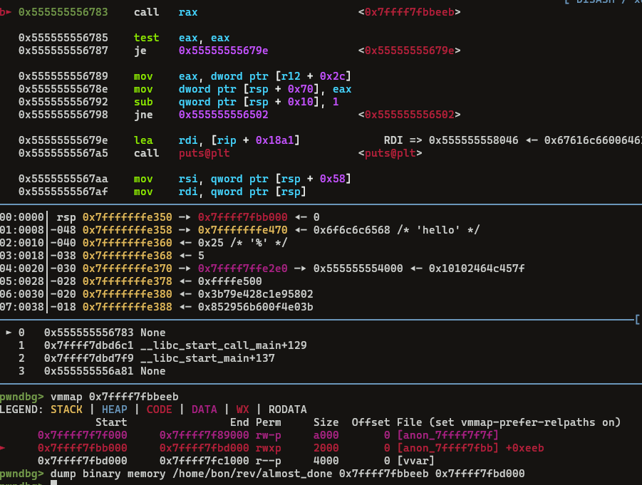

found one, dumped

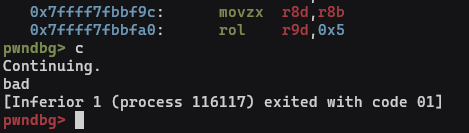

There seems to have just one flag_check func

## Finishing

The dumped out function looks legit, decompiled it in IDA, note that:

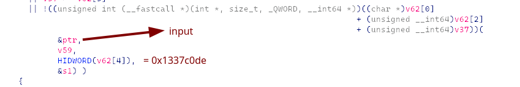

And I got the reverse script

```
def ror4(x, n): return ((x >> n) | (x << (32-n))) & 0xFFFFFFFF
def rol4(x, n): return ((x << n) | (x >> (32-n))) & 0xFFFFFFFF
  
expected_v18 = {}
for i in range(0, 8): expected_v18[i] = (0x2b48b515d43f4140 >> (i*8)) & 0xFF
for i in range(8, 16): expected_v18[i] = (0x35bcb75507c270f7 >> ((i-8)*8)) & 0xFF
for i in range(16, 24): expected_v18[i] = (0x841e959c29c8f1e7 >> ((i-16)*8)) & 0xFF
for i in range(24, 32): expected_v18[i] = (0x1e7c68fc9ce020c2 >> ((i-24)*8)) & 0xFF
for i in range(32, 37): expected_v18[i] = (0x000000daf7d998de >> ((i-32)*8)) & 0xFF
expected = [expected_v18[i] for i in range(37)]

v6 = 0x1337c0de ^ 0xc0def00d
v10 = 0; v9 = 0
flag_chars = []; all_ok = True

for i in range(37):
	tmp = (v6 + v10 - 0x61c88647) & 0xFFFFFFFF
	next_v6 = (rol4(tmp, 5) ^ ror4(tmp, 3)) & 0xFFFFFFFF
	r10d = (next_v6 >> 8) & 0xFFFFFFFF
	ecx_add = (((next_v6 >> 16) & 0xFFFFFFFF) + v9) & 0xFF
	A = (i*17 ^ next_v6 ^ r10d) & 0xFF
	needed = (expected[i] - ecx_add) & 0xFF
	
	flag_chars.append((A ^ needed) & 0xFF)
	v6 = next_v6
	v10 = (v10 + 0x45d9f3b) & 0xFFFFFFFF
	v9 = (v9 + 0xb) & 0xFFFFFFFF

flag_inner = ''.join(chr(c) for c in flag_chars)
print(f"gigem{{{flag_inner}}}")
```

## Flag

`gigem{this_will_be_the_flag_for_challenge_7}`

# war-hymn [rev]

*this would later be updated*