# nucleus [rev]

The challenge provided a binary `nucleus21.exe`. I tried running it, and it creates a new file `nucleus22.exe` after receiving input. I noted that the new file is larger.

## First impression


First, it makes a copy of itself (with a different index), and then `sub_1400010D0` modifies that new copy.

## Inside 

Note that `v7` holds a copy of the file.

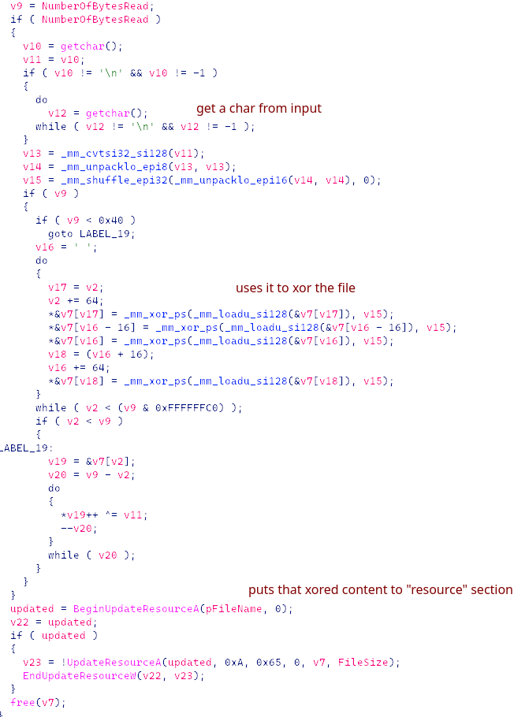

I guessed that the flag was fed to the nucleus in the form of 21 single bytes.

There are two things left to answer now:
1. Address the "resource" - how do we extract it?
2. How should we recover the bytes?


## Solution

1. By looking it up, I found that the resource section is `.rsrc`. Claude generated an extraction script for me.
2. It XORed the entire binary file, which means the magic bytes also got XORed.

```python
import pefile
from pwn import xor

flag = ""

for i in range(20, -1, -1):
	pe = pefile.PE(f"nucleus{i+1}.exe")
	for res_type in pe.DIRECTORY_ENTRY_RESOURCE.entries:
		if res_type.id == pefile.RESOURCE_TYPE['RT_RCDATA']:
			for res_id in res_type.directory.entries:
				if res_id.id == 101:
					for res_lang in res_id.directory.entries:
						data_rva = res_lang.data.struct.OffsetToData
						size = res_lang.data.struct.Size
						payload = pe.get_data(data_rva, size)
						key = payload[0] ^ ord('M')
						flag += chr(key)
						open(f"nucleus{i}.exe", "wb").write(xor(payload,key))

print(flag[::-1])
```

## Flag

`gigem{RCD4Ta_i5_N3aT}`

***

# challenge7 [rev]

The challenge provides a binary file `challenge7` that validates an input. 
After a quick scan, I caught these:


Then, the input stays untouched and gets passed to a JIT function compiled with some VM-like code.


Scrolling down:


I think we should set a breakpoint there and dump out the validating function(s), eh?
Let's check for anti-debugging measures; there should be some standing in our way.

## The hunt

### outside the loop

I first found this:


`sub_32D0` appears at the start of the loop as well; let's see what's inside.

### `sub_32D0`


While inspecting `xmmword_106E0`, I found something familiar.


It matches `xmmword_106E0`. I concluded that `sub_3220` is SHA-256, and from that, derived that `sub_2B60` and `sub_3010` are also part of the SHA-256 process (I'm going to rename them for later analysis).

If the hash passes, then `a1[3] = a1[4] = 0`.

The rest of this check function is just a debugger check (`iPrecarT :d`) and a hook check (`LD_PRELOAD`): it corrupts `a1[3]` and `a1[4]` if there is anything suspicious.

We can conclude that `sub_32D0` sets `v62[6] = ... = v62[9] = 0` (if things run normally).

With that finding, **I just need to keep an eye out for anything that touches `v62[6:10]`**, and also `v62[10:12]` because they hold information about the runtime `.text` section.

### inside the loop

I found just this one:


The other parts are just VM things; it feeds the VM state into those hashes too.
I guess we don't need to touch them (reading all that makes me feel dizzy as hell, nah).

## Patching

I gathered that we just need to patch `sub_3220` so it doesn't screw up our `v62`.

hmmmmmmm.....

"Hey Claude, nop-nuke this shit for me (remember to return 1)."


Found one, dumped it.


There seems to be just one `flag_check` func.

## Finishing

The dumped function looks legit. I decompiled it in IDA. Note that:


And I got the reverse script:

```python
def ror4(x, n): return ((x >> n) | (x << (32-n))) & 0xFFFFFFFF
def rol4(x, n): return ((x << n) | (x >> (32-n))) & 0xFFFFFFFF
  
expected_v18 = {}
for i in range(0, 8): expected_v18[i] = (0x2b48b515d43f4140 >> (i*8)) & 0xFF
for i in range(8, 16): expected_v18[i] = (0x35bcb75507c270f7 >> ((i-8)*8)) & 0xFF
for i in range(16, 24): expected_v18[i] = (0x841e959c29c8f1e7 >> ((i-16)*8)) & 0xFF
for i in range(24, 32): expected_v18[i] = (0x1e7c68fc9ce020c2 >> ((i-24)*8)) & 0xFF
for i in range(32, 37): expected_v18[i] = (0x000000daf7d998de >> ((i-32)*8)) & 0xFF
expected =[expected_v18[i] for i in range(37)]

v6 = 0x1337c0de ^ 0xc0def00d
v10 = 0; v9 = 0
flag_chars =[]; all_ok = True

for i in range(37):
	tmp = (v6 + v10 - 0x61c88647) & 0xFFFFFFFF
	next_v6 = (rol4(tmp, 5) ^ ror4(tmp, 3)) & 0xFFFFFFFF
	r10d = (next_v6 >> 8) & 0xFFFFFFFF
	ecx_add = (((next_v6 >> 16) & 0xFFFFFFFF) + v9) & 0xFF
	A = (i*17 ^ next_v6 ^ r10d) & 0xFF
	needed = (expected[i] - ecx_add) & 0xFF
	
	flag_chars.append((A ^ needed) & 0xFF)
	v6 = next_v6
	v10 = (v10 + 0x45d9f3b) & 0xFFFFFFFF
	v9 = (v9 + 0xb) & 0xFFFFFFFF

flag_inner = ''.join(chr(c) for c in flag_chars)
print(f"gigem{{{flag_inner}}}")
```

## Flag

`gigem{this_will_be_the_flag_for_challenge_7}`

***

# war-hymn [rev]

Inspecting `main`, I found a repeating pattern like this:

```python
v = ...
if debugger_present():
	corrupt(v)

new_v = b''
for i in range(len(v))
	new_v += v[i] ^ (xmmword_403070[i] + 21)
```

After 1 or 2 blocks like that, it feeds the decrypted strings to another function. 

I began by checking the code around the first two RC4 decodes:

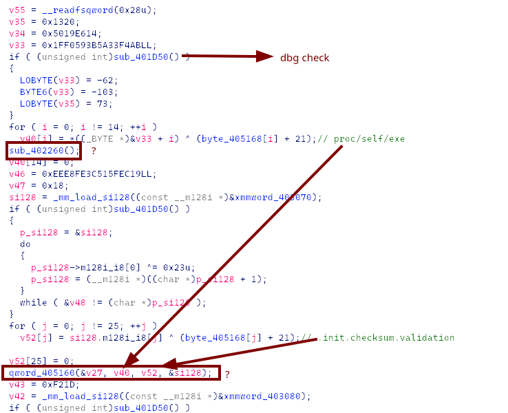

## `sub_402260` & `qword_405160`

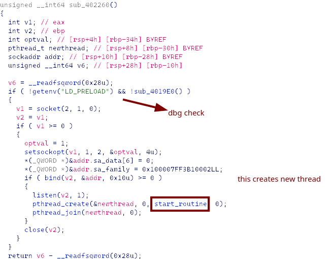

Checking the routine:

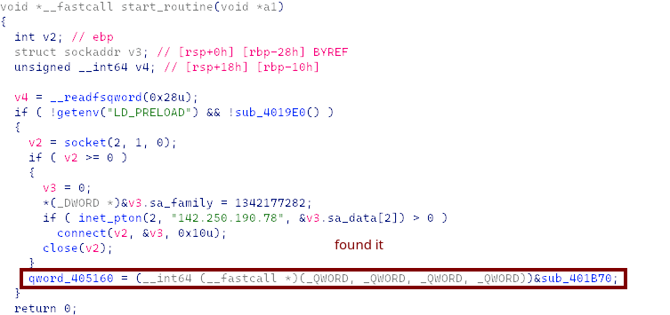

Keeping going, note that:
```text
qword_405160(v27, v40, v52)
v40 = proc/self/exe
v52 = .init.checksum.validation
```
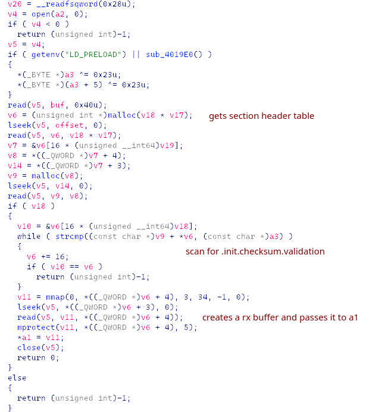

## jump back to `main`

The next strings are `.bss.secure.buffer` and `.init.constructors.global`, which get passed to `sub_401D90`.

`sub_401D90` also scans for the data section. It passes the found section pointer to the second argument and assigns the length to the third argument.

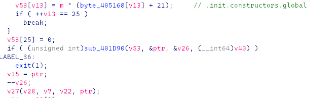

Everything is then fed to the function in `v27`, holding the `.init.checksum.validation` section. I guess now we need to find out what that was.

## Dumping

Speaking of ELF sections, let's use `readelf` to see where they live.

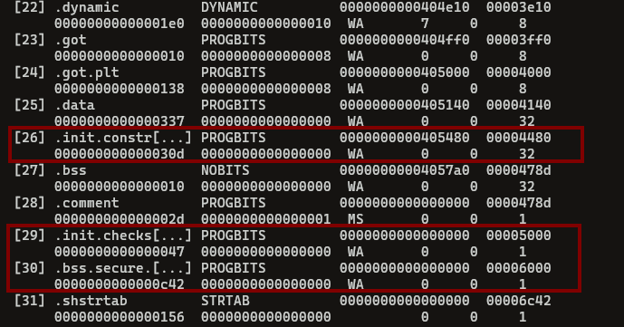

It calls a function at `.init.checksum.validation`, so I dumped that section:

```python
data = open("war-hymn", "rb").read()[0x5000 : 0x5000 + 0x47]
open("init_constructors_global.bin", "wb").write(data)
```

and put it in IDA:

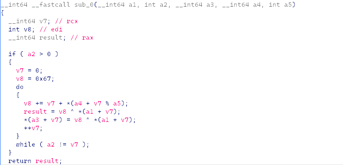

`a1`: encrypted data ptr, `a2`: data len, `a3`: dest, `a4`: key ptr, `a5`: key len

This takes 5 args, but the pseudocode showed just 4. Let's check the ASM in `main` again:

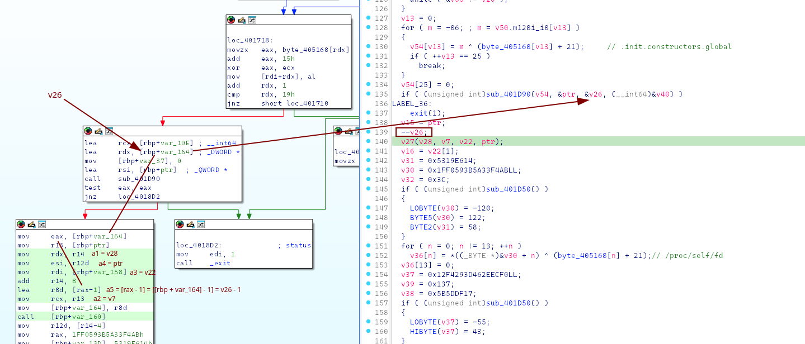

So this should be the correct replication:

```python
with open('war-hymn','rb') as f:
	d = f.read()

ctor_key = d[0x4480:0x4480+0x30d]
bss = d[0x6000:0x6000+0xc42]

def decrypt_checksum(src, key, key_len, init_acc=0x67):
	acc = init_acc
	out = bytearray()
	for i, b in enumerate(src):
		idx = i % key_len
		val = key[idx] + i
		acc = acc + val
		out.append(b ^ (acc & 0xff))
	return bytes(out)
	
  
dec = decrypt_checksum(bss, ctor_key, 0x30d-1)
open('decrypted_thing','wb').write(dec)
```

I was curious, so I threw it into DiE and ImHex:

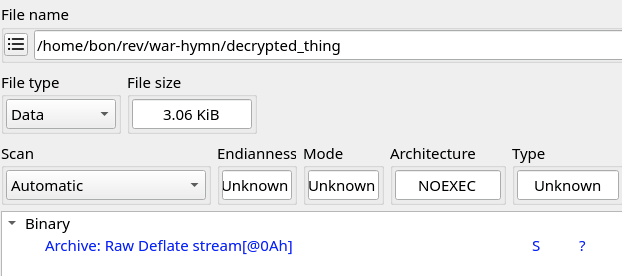

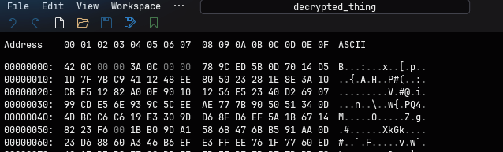

Jackpot. That `78 9C` are the magic bytes of zlib.

Later analysis of `sub_4020D0 -> sub_401F90` also confirms that there is some sort of inflating (decompression).

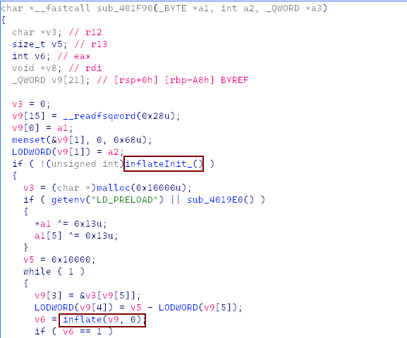

Let's decompress it and see what it holds:

```python
import zlib

compressed = open("decrypted_thing", "rb").read()
#
decompressed_data = zlib.decompress(compressed[8:])
open("is_this_final", "wb").write(decompressed_data)
```

## Last file to analyze

The decompressed binary has some functions as follows:

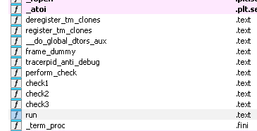

`run` is the entry point. Now things are in plain sight.

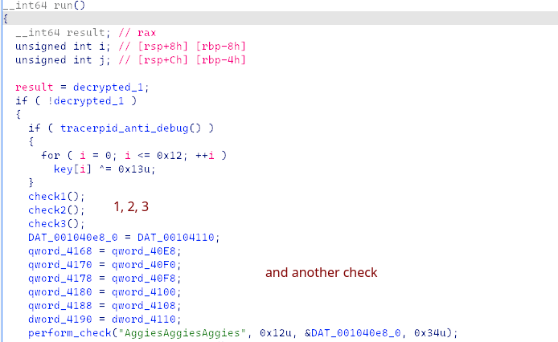

```python
file = open('is_this_final','rb').read()
  
def rc4(key, data):
	# rc4 implement here
	return bytes(out)

key = b'AggiesAggiesAggies'

data1 = file[0x3080:0x3080+0x12]
dec1 = rc4(key, data1)

data2 = file[0x3098:0x3098+0x0f]
dec2 = rc4(key, data2)
  
data3 = file[0x30b0:0x30b0+0x11]
dec3 = rc4(key, data3)

dat4110 = file[0x30e0:0x30e0+0x34]
dec4 = rc4(key, dat4110)
```

## Flag 

`gigem{sh0uld_h4v3_r4n_th3_b411_0n_f1r$t_4nd_g04l!!!}`
