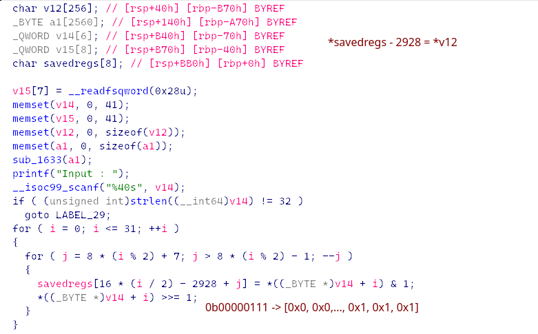
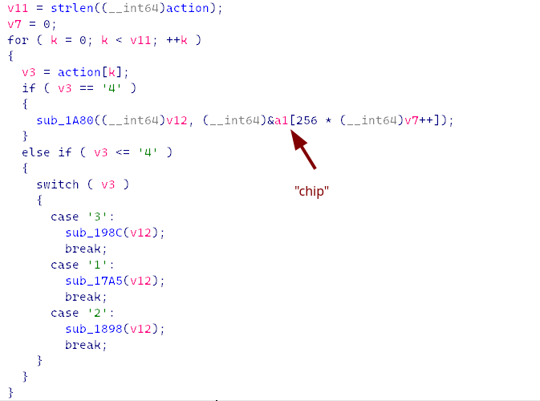
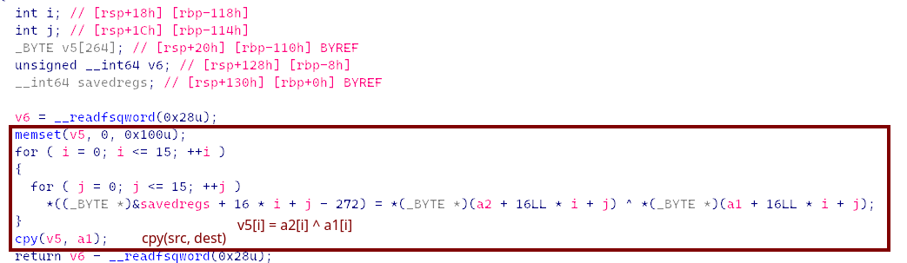
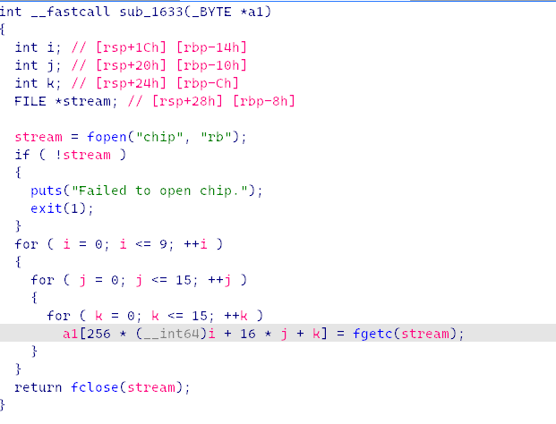
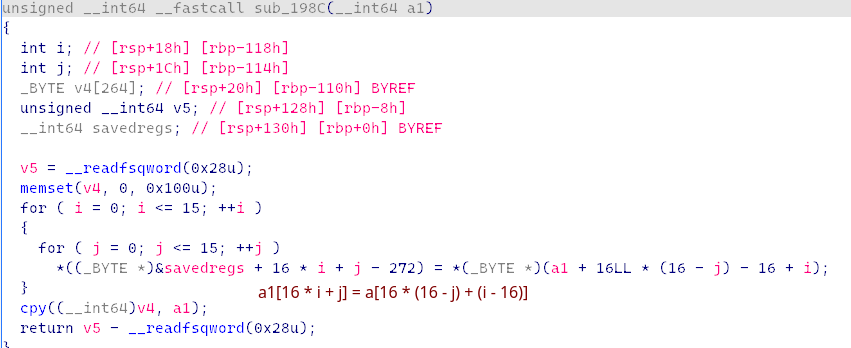
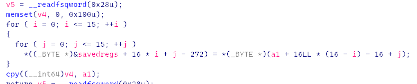
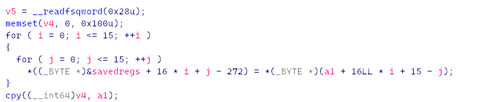
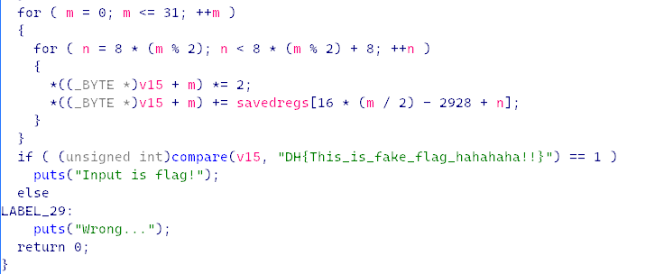

[[rev probs]]

## get input


input is 32 bytes
each byte is chopped into bits, each bit get padded with 0s to get a byte
so it turned into an array of 256 bytes
## operations


`action = "123423123413122123432132121243123123431232123142131342121324123241234"`

### `sub_1A80` (case 4)


#### a1


just xoring

### `sub_198C` (case 3)


quick math:
`a1[16*a + b] = a1[16*? + ?]`
let: `15 - j = a`
then: `j = 15 - a`  and `i = b`

so reverse is
```
temp = [0] * 256
for a in range(16):
	for b in range(16):
		temp[16*a + b] = a1[16*b + (15-a)]
a1 = temp
```

### `sub_1898` (case 2)

similar here

```
for a in range(16):
	for b in range(16):
		temp[16*a + b] = a1[16*(15-a) + b]
```

### `sub_17A5` (case 1)



```
for a in range(16):
	for b in range(16):
		temp[16*a + b] = a1[16*a + (15-b)]
```

## last part


just put things back together

## PoC

`DH{Flip_Spin_Switch_to_the_goal}`
script: https://github.com/leovanbon/mypyparsescripts/blob/main/trsnfmatns.py