[[cs]]
## 1. [dungeon-in-1983](https://dreamhack.io/wargame/challenges/1212)

The .zip Dream gave me containes 2 binaries. Brief inspection showed that their decompiled pseudocode is identical so I'm just going to analyze the deploy/prob.

The binary reads our input and validates it using `FUN_00101407`. Provide the correct *spell* 10 times to retrieve the flag.
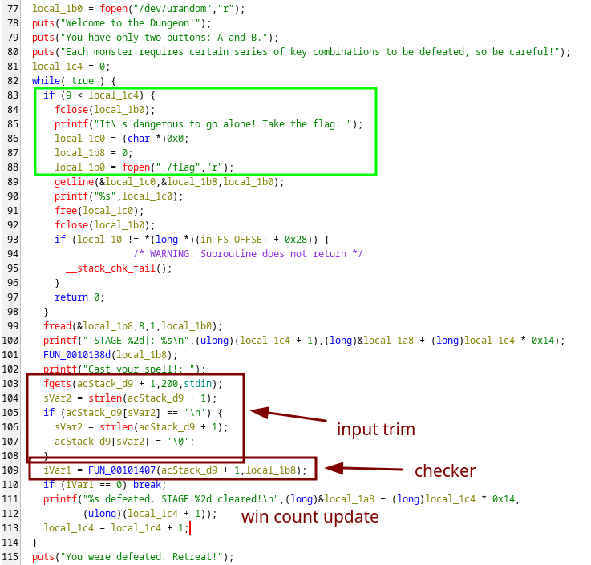

### Analysis of `FUN_00101407`

Diving into `FUN_00101407`. There is only one return line: `return local_10 == param_2` when it is done iterating through `param_1`
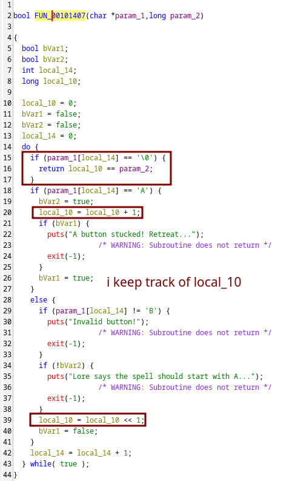
Regarding `local_10`, i can see that
- `local_10 = local_10 + 1` if `param_1[i] == 'A'`
- `local_10 = local_10 << 1` if `param_1[i] == 'B'`

### Solution

Since `param_1` is our input, i got this for constructing *the spell* if given `param_2` (or `local_1b8`):
```
for chr in f"{by:b}":
	if chr == '1': spell = spell + 'A'
	spell = spell + 'B'
```

Stepping back to `main`, `local_1b8`  receives bytes from  `local_1b0`, which reads from `/dev/urandom`. There is `FUN_0010138d` prints the *monster's stats* using all the bytes from `local_1b8`.
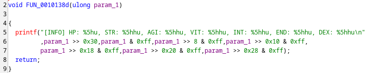
From that, I have this to retrieve the random byte `local_1b8`:
`local_1b8 = (hp << 0x30) | str | (agi << 8) | (vit << 0x0) | (int << 0x18) | (end << 0x20) | (dex << 0x28) `

Finally, I wrote this script that did the job:
```
import re
from pwn import *

p = process("./prob")
#p would change

for i in range(10):
	p.recvuntil(b']:')
	
	monster = p.recvuntil(b'Cast your spell!: ').decode()
	in4 = [int(s) for s in re.findall(r'\d+', monster)]
	print(in4)
	
	by=0
	for j in [0,6,5,4,3,2,1]:
		by = by + in4[j]
		by = by << 8
	by = by >> 8
	
	spell = ""
	for chr in f"{by:b}":
		if chr == '1': spell = spell + 'A'
		spell = spell + 'B'
	spell = spell[:-1]
	
	print(spell)
	p.sendline(spell.encode())
p.interactive()
```

### Flag

*Note: At the time of writing, I was having a problem with `pwntools remote()` so I'll update the flag later.*
## 2. [photographer](https://dreamhack.io/wargame/challenges/1998)

Dream gave me a binary and an encoded flag.
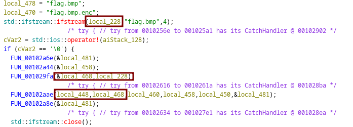
At a glance, it seems that byte stream from the flag is parsed into `local_448` *(as this later be used in the check loop)*:

### Loop Analysis

In the loops: `local_480` is the index;

`FUN_00102bb6` simply gets the pointer to the next byte
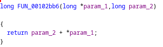

`FUN_001024c2` is shift left, `FUN_00102489` is shift right
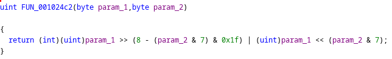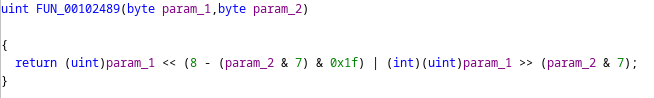

`*puVar7 = uVar3` updates the new value

With that in mind, i wrote the decoder, with `r` for the `rand()`:
```
if i % 3 == 2:
	dec = (current_byte + 0x18) ^ r
elif i % 3 == 0:
	dec = ((current_byte >> 4 | current_byte << 4) - r) % 256
	dec = dec >> 1 | dec << 7
else:
	r = r % 8
	dec = current_byte << r | curr_by >> (8-r)
```


Knowing that the program uses `srand(0xbeef)`, we can replicate all the `rand()` in the binary, the full script is written as below:

### Full Script
```
import ctypes
libc = ctypes.CDLL("libc.so.6")
libc.srand(0xbeef)

with open("flag.bmp.enc", 'rb') as data, open("flag.bmp", 'wb') as flag:
	i = 0
	while(True):
		cur = data.read(1)
		if (not cur): break
		current_byte = int.from_bytes(cur)
		r = libc.rand() % 256
		
		if i % 3 == 2:
			dec = (current_byte + 0x18) ^ r
		elif i % 3 == 0:
			dec = ((current_byte >> 4 | current_byte << 4) - r) % 256
			dec = dec >> 1 | dec << 7
		else:
			r = r % 8
			dec = current_byte << r | curr_by >> (8-r)
		
		flag.write(bytes([dec % 256]))
		i = i + 1
```

### Flag
*DH{d85a130283f58035eb327b56e37d2dd087156ba629687a5d52bd4af3c5bfa4f4}*

## 3. [similar](https://dreamhack.io/wargame/challenges/1670)

The program gives us a list of list, each containing 3 integers ranging from -100 to 100. After showing, it then sorts that list using `FUN_001017c8`. If we get the sorted order right, we get the flag.
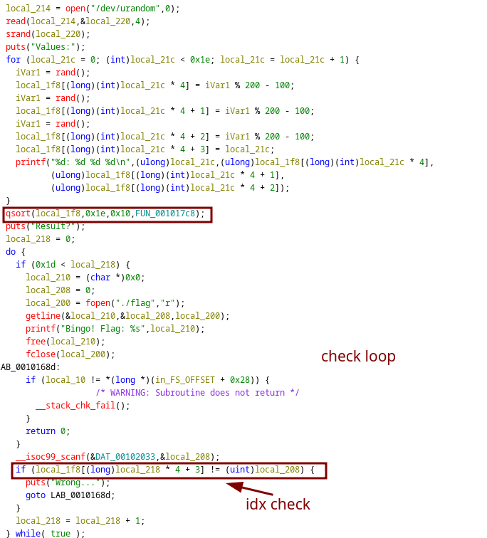

### Analysis of `FUN_001017c8`

This fuction calculates value from the *list of 3 integers* and compares them:
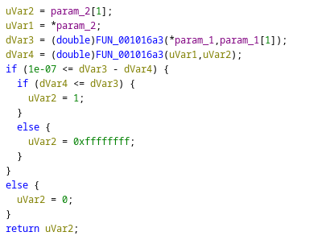

Let's check the `FUN_00106a3`
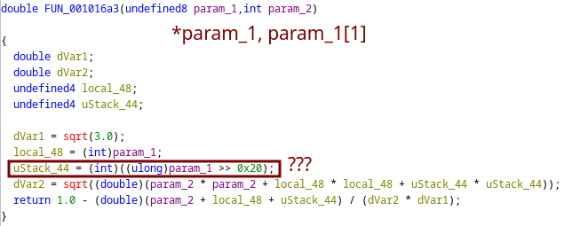
While examining, there is this `param_1 >> 0x20` appeared a little confusing. Suspecting that Ghidra might have analyzed it wrong, I take a look at the assembly:
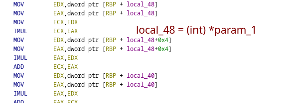

By default `int` is 4 bytes so `[RBP + local_48 + 0x4] = param_1[1]`.

Further inspection of the assembly in `FUN_001017c8` revealed that the value loaded into `FUN_00106a3` was actually `param_1[2]`.
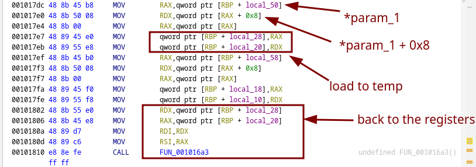

### Implementation
Now we know how it sorts, implement it and we're done:
```
from math import sqrt
from pwn import *
from functools import cmp_to_key

def cal(a): 
	return (1- (a[1] + a[2] + a[0])/ (sqrt(3) * sqrt(a[1]*a[1] + a[0]*a[0] + a[2]*a[2])))

def compar(a,b):
	x = cal(a)
	y = cal(b)
	if x<y: return -1
	elif x>y: return 1
	else: return 0

r = remote('host8.dreamhack.games', 15703)
data = r.recvuntil(b'Result?').decode()
arr = [list(map(int, line.split(':')[1].split())) + [int(line.split(':')[0])] for line in data.splitlines() if ':' in line and line.split(':')[0].strip().isdigit()]
sor = sorted(arr, key=cmp_to_key(compar))
payload = " ".join(str(a[3]) for a in sor)
r.sendline(payload.encode())
r.interactive()
```

### Flag
 *DH{s1m1l4r_in_c0s1n3:2OL5p3IWpaiDXt3T0dPUkg==}*
 
## 4. [CrabME](https://dreamhack.io/wargame/challenges/2147)

>"Con cua tám cẳng hai càng
>Một mai hai mắt rõ ràng con cua"

I spotted `flagchecker()`, `lVar5` serves as the index. The validation process begins when `lVar5 == 64`.
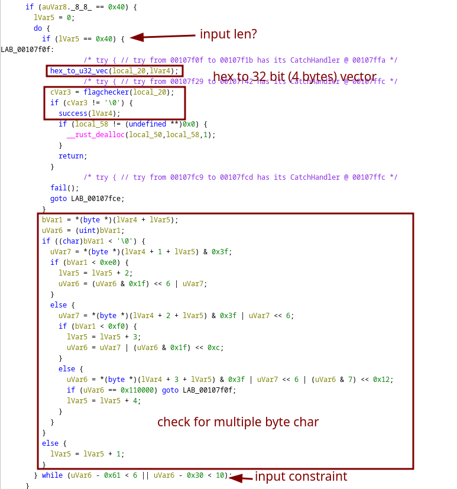
I was confused about that thing with `uVar6, uVar7` below. After some time looking it up, it's handling the reconstruction of 1, 2, 3 or 4-byte character.

### Inspecting the Logic

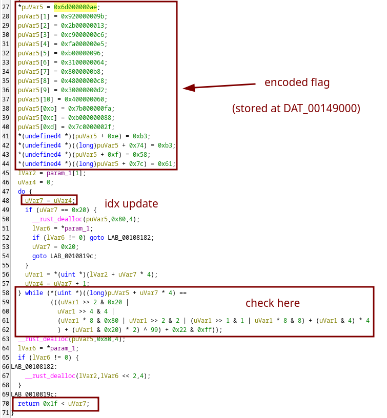


I rewrite the check logic with `x := uVar1` as below:
```
(((x >> 2 & 0b00100000 |  x >> 4 & 0b00000100 | (x << 3 & 0b10000000 |
   x >> 2 & 0b00000010 | (x >> 1 & 0b00000001 |  x << 3 & 0b00001000)
+ (x << 2 & 0b00010000) + (x << 1 & 0b01000000)) ^ 99) + 0x22 & 0xff
```
Turns out it shuffles the bits of `x` and do some simple operations.
### Reversing
Reverse it and now we're done...
```

enc = bytearray(b'\xae\x00\x00\x00\x6d\x00\x00\x00\x9b\x00\x00\x00\x92\x00\x00\x00\x13\x00\x00\x00\x2b\x00\x00\x00\xc6\x00\x00\x00\xc9\x00\x00\x00\xe5\x00\x00\x00\xfa\x00\x00\x00\x96\x00\x00\x00\x0b\x00\x00\x00\x64\x00\x00\x00\x31\x00\x00\x00\xb8\x00\x00\x00\x08\x00\x00\x00\xc8\x00\x00\x00\x48\x00\x00\x00\xd2\x00\x00\x00\x30\x00\x00\x00\x60\x00\x00\x00\x04\x00\x00\x00\xfa\x00\x00\x00\x7b\x00\x00\x00\x88\x00\x00\x00\xb0\x00\x00\x00\x2f\x00\x00\x00\x7c\x00\x00\x00\xb3\x00\x00\x00\xb3\x00\x00\x00\x58\x00\x00\x00\x61\x00\x00\x00')

def shufflelelele(b):
	crab_map = [1, 3, 6 , 0, 2, 7, 5, 4]
	return sum((((((b - 0x22) & 0xff) ^ 99) >> i) & 1) << crab_map[i] for i in range(8))

print(''.join(chr(shufflelelele(b)) for b in enc[::4]))
```
...or not.


Notice that in the `main`, our flag is 64 chr long, but there is only 32 given encoded bytes. The loop in `main` check if the input chr is `[a-f] or [0-9]`:


I try to convert the decoded bytes to hexes and it works:
```
print(''.join(f"{shufflelelele(b):02x}" for b in enc[::4]))
```

### Flag
 *DH{fb810d0e1ca97a70909f4e1982e1f65272623ee367129f8d42f3e987bcbc6665}*
